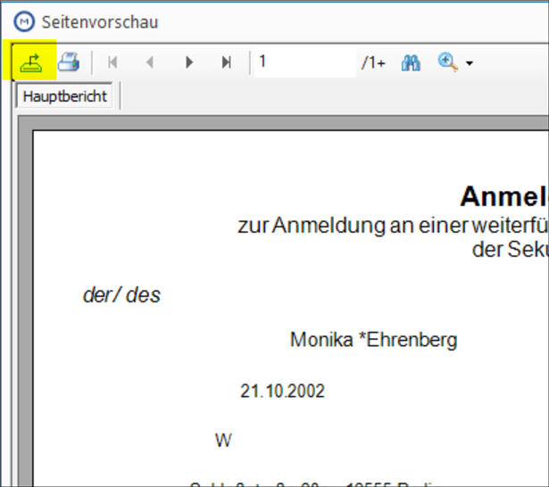

# M01 - MAGELLAN Einführungsschulung

Diese Unterlagen fassen die in der MAGELLAN - Einführungsschulung behandelten Themen zusammen. Eine umfangreichere Dokumentation zu MAGELLAN bietet Ihnen das [Benutzerhandbuch](http://doc.magellan7.stueber.de).

Hinweis | Bemerkung
--------------- | ---------
**Dauer:** | 7 x 45 min
**Themen:** | - Zeitraumkonzept<br/>- Handling der Auswahllisten in MAGELLAN<br/>- Schlüsselverzeichnisse<br/>- Dateneingabe für Bewerber/Schüler<br/>- Schülerlaufbahn (zum Beispiel Fortschreiben oder Versetzen von Schülern)<br/>- allgemeiner Druck <br/>- Seriendruck aus MAGELLAN<br/>- Dokumentenverwaltung
**Zielgruppe:** | Mitarbeiter des Schulsekretariats
**Ablauf**:|09:30 – 11:00 Uhr  <br/>11:15 – 12:45 Uhr <br/>13:30  -  15:45 Uhr 

## Die Anmeldung

Standardmäßig meldet man sich mit dem Benutzer `sysdba` und dem Kennwort `masterkey` an. Ihr Administrator wird für Sie ein individuelles Kennwort einrichten. Unter `Datenbank` kann man einstellen, in welche Datenbank man sich einloggen möchte. Es besteht die Möglichkeit, mehrere Datenbankverbindungen anzulegen. Die Vorgehensweise erfahren Sie in unserer MAGELLAN-Administratoren-Schulung. Die Schulungstermine finden Sie im Internet unter [www.stueber.de](http://www.stueber.de/training.php)


## Der Willkommen-Bildschirm

Unsere Module starten mit einer Willkommensseite, die später auch über `Hilfe > Willkommen` erneut aufgerufen werden kann. Der Willkommensbildschirm enthält beispielsweise Links zu unseren Dokumentationen, zu den Downloads, zum Ticketsysstem oder zu unseren Social Media-Seiten. 
Auf der rechten Seite gibt es einen Bereich mit nach Erscheinungsdatum sortieren Hinweisen, über die wir Sie per Newsfees informieren möchten. Diese Informationen können nur gezeigt werden, wenn eine Internetverbindung aufgebaut ist.


## Schlüsselverzeichnisse - Bundeslandspezifische Schlüssel

In MAGELLAN finden Sie verschiedene Arten von Formularfeldern. Die einen sind frei auszufüllen (z.B. der Name), bei den anderen wurde eine Liste hinterlegt (z.B. Konfessionen), aus denen Sie Einträge auswählen müssen.


Diese Tabellen heißen Schlüsselverzeichnisse und sind in MAGELLAN Quellen für viele Eingabefelder auf den Formularen. Sie sollen Ihnen die Arbeit bei der Dateneingabe erleichtern. Daten, die nicht in den Schlüsselverzeichnissen hinterlegt wurden, stehen Ihnen für den Eintrag in das Formularfeld nicht zur Verfügung. Sie sollten also, wenn Sie anfangen mit MAGELLAN zu arbeiten, diese Verzeichnisse  durch den Import befüllen und ggfs. editieren und den Datenbestand für Ihre Anforderungen passend gestalten. Um die Schlüsselverzeichnisse aufzurufen, klicken Sie auf `Extras > Schlüsselverzeichnisse`. Es öffnet sich das Dialogfenster `Schlüsselverzeichnisse`. 


## Funktionalitäten der Auswahlliste und Assistentenlisten

In den MAGELLAN-Auswahllisten (Schüler, Bewerber, Klassen, Lehrer...) und auch in allen MAGELLAN-Assistenten gibt es Möglichkeiten bestimmte Sortierungen vorzunehmen.

Zum Beispiel möchten Sie beim Einschulen die Schüler nach dem Einschulmerkmal sortieren oder Sie möchten gern für alle männlichen, katholischen Schüler eine Liste generieren? Oder Sie hätten gern einen schnellen Überblick über alle derzeit aktiven Schüler an Ihrer Schule. Dafür gibt es verschiedene Möglichkeiten diese Listen- oder Assistentenanzeigen zu gestalten, die wir Ihnen nachfolgend vorstellen.

### Sortieren der Spalten (Mehrfachsortierung)

Sie haben die Möglichkeit, den Inhalt der Auswahllisten zu sortieren, wobei die Kriterien, nach denen sortiert wird, die einzelnen Spaltenköpfe sind. Dies ermöglicht Ihnen beispielsweise bei der Auswahlliste Schüler nach Nachname, Vorname, Ort, Geschlecht usw. zu sortieren.

Um nach einem Kriterium zu sortieren, müssen Sie den entsprechenden Spaltenkopf anklicken. Diese Daten der Auswahlliste werden dann nach der Spalte aufsteigend sortiert. Ein nochmaliger Klick auf den Spaltenkopf bewirkt eine absteigende Sortierung.

Sie entfernen die Sortierung wieder, indem Sie die `Strg-Taste` gedrückt halten und auf den Spaltenkopf klicken.

Sie können auch nach mehreren Kriterien gleichzeitig sortieren lassen. Wenn Sie die Schülerliste z.B. zuerst nach Klassen, dann nach Schülernachname und im Anschluss nach Vornamen sortieren wollen, gehen Sie wie folgt vor:

1. Klicken Sie auf den Spaltenkopf `Klassen`, um diese aufsteigend zu sortieren.

2. Drücken Sie die `SHIFT-Taste` und halten Sie diese gedrückt. Klicken Sie dann auf den Spaltenkopf `Nachname` und anschließend auf `Vorname`.

Ergebnis: Die Schüler sind innerhalb der Klassen nach Nachnamen und innerhalb der gleichen Nachnamen nach Vornamen sortiert.


### Gruppieren der Spalten (Mehrfachgruppierung)

Das Gruppieren ermöglicht Ihnen, die Tabelle nach ganz bestimmten Gesichtspunkten zu untergliedern, so dass Sie eine bessere Übersicht erhalten und auch Übersichtszahlen je nach Gruppierung erhalten.

Sie können z.B. nach Klassen gruppieren, um die Schüler immer klassenweise zu sehen.

Gehen Siewie folgt vor:

1. Klicken Sie auf den gewünschten Spaltenkopf, z.B. die Klasse.
2. Halten Sie die Maustaste gedrückt und ziehen Sie den Spaltenkopf in den darüber liegenden etwas dunkleren Bereich.

3. Hier können Sie die gedrückte Maustaste loslassen und der Spaltenkopf befindet sich nun ausgelagert.
Das Aussehen der Auswahlliste hat sich mit der Gruppierung verändert. Vor einer Klasse befindet sich jeweils ein Plus oder ein Minus. Wenn Sie auf das Plus klicken öffnet sich die Liste der Schüler, die in der Klasse sind. Klicken Sie auf das Minus, dann schließt sich die Liste der zugehörigen Schüler wieder.

Bei einer Mehrfachgruppierung ziehen Sie nacheinander zwei Spaltenköpfe in den dunkleren Bereich. Die Gruppierung wird dann noch mal nach einem zweiten Gruppierungsaspekt untergliedert, so könnte man die Gruppierung nach Klassen z.B. noch mal nach dem Geschlecht gruppieren.


!!! info "Hinweis"

     Bitte bedenken Sie, dass die gezeigten Zahlen sich auch ausgeschulte oder nicht eingeschulte Schüler (Vagabunden) befinden können. Wenn Sie gruppieren um zum Beispiel die Anzahlen der Schüler pro Klasse zu erhalten, sollten Sie als erstes nach der Spalte ```Status``` (Spalte mit den grauen oder blauen Rauten) und anschließend nach der ```Klasse``` gruppieren. In der Gruppierung `aktiv` finden Sie dann die korrekten Zahlen.

### Inkrementelle Suche in der Auswahlliste

Um einen Datensatz in einer Liste zu suchen, rufen Sie zunächst die entsprechende Auswahlliste auf. Wählen Sie die Spalte aus, die Sie nach einem Begriff durchsuchen möchten, dies wäre z.B. die Spalte `Nachname`, wenn Sie einen Schüler mit dem Nachnamen `Schulze` suchen würden. Klicken Sie nun auf einen beliebigen Datensatz in der Spalte `Nachname`. Geben Sie nun über die Tastatur den Suchbegriff ein. Diese Eingabe überschreibt keine Daten, da die Auswahlliste schreibgeschützt ist. Die Eingabe in der Auswahlliste hat immer einen Suchlauf zur Folge. Der eingegebene Begriff wird mit allen Einträgen in der Spalte verglichen. Der Datensatz mit der größten Übereinstimmung wird aufgerufen.

Wurden mehrere Entsprechungen gefunden, können Sie mit ```STRG``` und ```Pfeiltaste auf oder ab``` zum nächsten Datensatz wechseln.

### Markieren

Die nachfolgend beschriebenen Vorgehensweisen gelten für alle Auswahllisten und sämtliche Assistenten.

#### Einzelmarkierungen in der Auswahlliste

```Strg``` halten und per Mausklick die gewünschten Zeilen markieren.


#### Bereichsmarkierungen

Erste gewünschte Zeile anklicken, ```Umschalt(Shift)``` halten, letze gewünschte Zeile anklicken.


#### Alles Markieren

Klicken Sie auf das kleine Kästchen unten links am Rand.


### Filtern

In MAGELLAN können die Daten in allen Auswahllisten gefiltert werden. Die Filterfunktion kann im Spaltenkopf der zu filternden Spalte aufgerufen werden, es ist ebenfalls eine Mehrfachfilterung möglich.


So können Sie zum Beispiel in der Auswahlliste der Schüler erst nach aktiven Schülern filtern (Spalte Status), dann nach einer Klasse und innerhalb dieser Klasse kann nach weiteren Eigenschaften gefiltert werden. Als Zeichen dafür, dass die Auswahlliste gefiltert angezeigt wird, sieht man im unteren Bereich die Filterleiste. Hier kann der Filter geschlossen werden oder auch über die Anpassen-Schaltfläche noch bearbeitet werden.


Sie erhalten im Bearbeiten-Fenster auch die Möglichkeit einen Filter zu speichern oder einen gespeicherten Filter wieder aufzurufen. Ein neu aufgerufener Filter, zeigt keine feste Auswahl von Datensätzen, sondern filtert die Auswahl immer auf dem derzeit aktuellen Stand.


### Ein- und Ausblenden von Spalten

Die in den jeweiligen Auswahllisten enthaltenen Spalten können von Ihnen ein- und ausgeblendet werden. Sie können das Fenster ```Spalten bearbeiten...``` aus dem jeweiligen Menüpunkt heraus unter ```Bearbeiten``` aufrufen. Das Fenster wird eingeblendet und Sie können die Spalte per Drag and Drop ins Fenster ziehen oder daraus wieder entfernen. Eine ausgeblendete Spalte bleibt solange ausgeblendet, bis Sie sie auf dem umgekehrten Weg wieder einblenden.


## Statusspalte

Die unterschiedlichen Status spiegeln den Zeitraumbezug wider. Diese Markierungen werden für den jeweiligen Schüler in allen Zeiträumen gleich gezeigt.

Ein Beispiel:
Schaut man sich die Daten eines Schülers in einem älteren Zeitraum in der Datenbank an, zeigt das blau gefüllte oder ungefüllte Kreis an, ob der Schüler aktuell noch Schüler Ihrer Schule ist oder bereits ausgeschult wurde.

|Status|Bedeutung|
|--|--|
|  | Aktiv, der Schüler besucht aktuell die Schule und wurde nicht ausgeschult |
|  | Inaktiv, der Schüler besucht aktuell nicht mehr die Schule und wurde ausgeschult |
|  | Pausierend, der Schüler besucht vorübergehend nicht die Schule, ist aber nicht ausgeschult |

## Registerkarten

### Registerkarte `Daten 1`

Sie müssen nicht alle Daten eintippen, sondern können sich an einigen Stellen einen Automatismus zunutze machen (z.B. den Postleitzahlenautomatismus). Auf den Registerkarten `Daten 2` bis `Daten 4` werden weitere Daten zum Schüler erfasst. Felder, die Sie an Ihrer Schule nicht benötigen, lassen Sie einfach ungefüllt.

!!! info "Hinweis"

    Für einige Felder der ersten Dátenkarten steht Ihnen eine Sammelzuweisung zur Verfügung. Sie finden sie aus den Menüpunkten ```Schüler oder Bewerber > Bearbeiten > Sammelzuweisung```.

#### Bereich `Daten 1 > Familie`

Ein neues Familienmitglied können Sie entweder im Rahmen der Aufnahme der Bewerber/Schüler erfassen oder direkt eingeben. Sie können auf die Menüpunkte Lehrer, Personen, Sorgeberechtigte oder Schüler verweisen. Nachdem Sie das Familienmitglied festgelegt haben, müssen Sie noch das `Verhältnis` und die `Benachrichtigungsart` zuordnen. Über die `Benachrichtigungsart` können Sie steuern, ob dieser Sorgeberechtigte z.B. bei Serienbriefen mit berücksichtigt werden soll oder nicht.

### Registerkarte `Daten 2`

Man kann hier u.a. aus dem Menü der Schulen bereits besuchte Schulen hinzufügen. `Zugang am` wird automatisch gesetzt, wenn der Schüler an Ihrer Schule eingeschult wird. `Voraus. Ende` ist manuell einzutragen. `2. Zugang am` wird z.B. benötigt, wenn eine Schülerin nach dem Mutterschutz zurückkehrt.

### Registerkarte `Daten 3`

Stellt man den Auskunftsstatus `Geheim` ein, so erscheint in allen Registerkarten des Schülers ein rotes Symbol `Geheim`, damit z.B. die Sekretärin erkennt, dass sie keine Informationen zum Schüler herausgeben darf. Zudem wird der Datensatz in der Auswahlliste mit roter Schrift angezeigt.
Sind dem Schüler auch Sorgeberechtigte zugeordnet worden, wird angeboten, diese auch mit zu markieren.

### Registerkarte `Merkmale`

Über die Registerkarte `Merkmale` können Sie beliebige weitere Merkmale eintragen. Ihnen stehen dazu sechs Merkmalsfelder (A1 bis A6) zur Verfügung, deren mögliche Werte Sie in den entsprechenden Schlüsselverzeichnissen eintragen können. Außerdem gibt es vier Merkmalsfelder (B1 bis B4), die Sie frei editieren können. Zusätzlich können Sie einen beliebigen Bemerkungstext zuordnen. Die Merkmale gibt es nicht nur beim Schüler, sondern auch beim Lehrer, beim Mandanten und bei der Klasse.

!!! info "Hinweis"

    Die Merkmalsfelder können unter `Verzeichnisse > Bezeichnungen` anpassen für die Datenbank umbenannt werden. Die Inhalten tragen Sie unter `Verzeichnisse > Merkmale` ein, bitte denken Sie daran auch für jeden erfassten Wert die Spalte `Bereich` zu füllen.

### Registerkarte `Ausbildung`

Die Registerkarte `Ausbildung` ist sichtbar wenn die Lizenz für das Modul `Berufsbildende Schule` oder `Praktikumsbetriebe` erworben wurde.
Es können hier beliebig viele Ausbildungsdatensätze pro Schüler erfasst werden. Der einzelen Eintrag kann den Ausbildungsbetrieb, ggfs. den Praxisbetrieb, Ausbilderkontaktdaten, den Beruf, den Bildungsgang, Vertragsdaten und weiteres enthalten. Ein Ausbildungsdatensatz kann als aktuelle Ausbildung des Schülers markiert werden.

### Registerkarte `Laufbahn`

Durch den Zeitraumbezug haben Sie stets die gesamte Laufbahn eines Schülers an Ihrer Schule im Blick. Diese Registerkarte wird um Einträge erweitert, wenn der Schüler in MAGELLAN eine Bewegung macht. Die Anzeige in der Registerkarte `Allgemein` und Registerkarte `Abschluss` bezieht sich auf den jeweiligen Zeitraum, den Sie links ausgewählt haben.

Auf der Registerkarte `Abschluss` kann der Abschluss des Schülers (z.B. Abitur) unter Abschluss 1 festgehalten werden. Hierbei handelt es sich um ein Schlüsselfeld, welches Sie über `Verzeichnisse|Weitere Schlüsselverzeichnisse` und dann `Abschlüsse (Intern)` mit Werten füllen können. Der Eintrag im Feld `Abschlussdatum` hat Bedeutung für Zeitraumbezeichnungen auf Abschluss /Abgangszeugnissen. Er ist das `Bis-Datum` auf diesen Zeugnissen. Optional können Sie unter `Abschluss 2` auch einen zweiten Abschluss des Schülers eintragen.

### Schaltfläche `Sammelzuweisung`

Über die Schaltfläche `Sammelzuweisung` können Sie in der Registerkarte `Allgemein` und in der Registerkarte `Abschluss` für mehrere Schüler gleichzeitig bestimmte Werte zuweisen.

### Weitere Sammelzuweisungen

Unter `Bearbeiten > Sammelzuweisungen` können u.a. Konfessionen, Staatsangehörigkeiten, Fremdsprachenfolgen, Zugang/Voraussichtliches Ende sowie Daten zur Ausbildung mehreren Schülern gleichzeitig zugewiesen werden.

## Verzeichnis `Zeiträume`

Der Zeitraumbezug in MAGELLAN spielt eine wichtige Rolle. Wenn Sie anfangen mit MAGELLAN zu arbeiten, sind noch keine Zeiträume definiert. Vor der eigentlichen Eingabe der anderen Daten in MAGELLAN müssen die notwendigen Zeiträume definiert werden.

Ein Zeitraum ist definiert durch ein Anfangs- und ein Enddatum. Es handelt sich hier auch um ein Schlüsselverzeichnis, das Sie unter dem Menü `Extras > Schlüsselverzeichnisse > Zeiträume` finden.

## Das Klassen-Menü

Klassendaten besitzen immer einen Zeitraumbezug. Sie stellen das Bindeglied zwischen Zeiträumen und Schülern dar. Jeder Klasse ist mindestens ein Zeitraum zugeordnet. Klassen sind mit ihren Schülern und den zugehörigen Fächern in jedem Zeitraum einzigartig. Daher werden in jedem Schuljahr die Klassen, die Sie benötigen, neu erfasst. Auf der Registerkarte `Daten` sind insbesondere die Einstellungen bei `Klassenart` und `Beurteilungsart` wichtig.

Um einen Schüler einschulen zu können, müssen zunächst in dem entsprechenden Zeitraum eine Klasse definiert werden.

## Schüler eingeben

Um einen neuen Schüler aufzunehmen, klicken Sie in der Startleiste auf der linken Bildschirmseite auf `Schüler` oder wählen Sie `Ansicht > Schüler`. Wählen Sie dann das Symbol
in der oberen Symbolleiste oder `Bearbeiten > Neuer Datensatz`. Es öffnet sich das Dialogfenster `Neuer Schüler`.

### Registerkarte `Schüler > Daten 1`

Nach Eingabe des Schülernamens und der Bestätigung durch `OK`, stellt sich der Eingabecursor automatisch auf die Registerkarte `Daten 1`.

Ansicht nach Neuanlage eines Schülers: In der Statusspalte ist noch kein Symbol, in der Klassenspalte ist ebenfalls noch kein Eintrag, da der Schüler noch nicht eingeschult und somit keiner Klasse und keinem Zeitraum zugewiesen wurde.

## Einschulen, Fortschreiben, Versetzen

### Schüler einschulen

Nachdem Sie die Daten der neuen Schüler erfasst haben, müssen Sie diese einer Klasse zuweisen, das heißt, sie müssen `eingeschult` werden. Mit der Zuordnung zu einer Klasse beginnt für den Schüler in MAGELLAN die zeitraumbezogene Dokumentation seines Werdegangs. Bitte beachten Sie, dass vor dem Einschulen die entsprechenden Klassen eingerichtet sein müssen.

!!! info "Hinweis"

    Alle Optionen, um einen Schüler in MAGELLAN zu bewegen, finden Sie unter dem Menü `Laufbahnprozesse`.

Gehen Sie wie folgt vor:

1. Klicken Sie auf `Laufbahnprozess > Schüler einschulen`. Beim Schüler einschulen ist Ihnen ein Assistent behilflich.
2. Klicken Sie jeweils auf `Weiter`, um zum nächsten Schritt des Assistenten zu kommen.
3. Unter `Schüler auswählen` werden alle Schüler aufgelistet, die noch nicht eingeschult worden sind. Bitte gehen Sie beim Einschulen klassenweise vor. Damit Sie die Schüler abhängig von bestimmten Eigenschaften, z.B. erster Fremdsprache oder Konfessionszugehörigkeit, einer Klasse zuweisen können, sind die entsprechenden Spalten hier ebenfalls angezeigt. Sie können die Spalten entsprechend denen der Gesamtliste bearbeiten. Haben Sie z.B. ein Einschulmerkmal vergeben (siehe `Registerkarte` Daten 1`) können Sie danach gruppieren und alle Schüler, die Sie einer Klasse zuweisen möchten, auf einmal markieren und einschulen.
4. Markieren Sie die Schüler, die Sie z.B. der Klasse 1a zuweisen möchten und klicken Sie auf `Weiter`.
5. Unter `Weitere Angaben` können Sie weitere Angaben per Sammelzuweisung allen ausgewählten Schülern zuordnen. Hierbei muss mindestens das Zugangsdatum angegeben werden.
6. Klicken Sie jetzt auf `Weiter` und anschließend auf `Fertigstellen`, um die Einschulung der Schüler durchzuführen.
Führen Sie anschließend den Assistenten erneut aus, die gewählten Einstellungen bleiben erhalten, bis Sie den Assistenten schließen.

### Schüler fortschreiben

Mit `Laufbahnprozess > Schüler fortschreiben` befördert man die Schüler vom 1. Halbjahr ins 2. Halbjahr (welches vorhanden sein muss). Auch beim Schüler fortschreiben ist Ihnen ein Assistent behilflich. Da die Klassenzugehörigkeit gleich bleibt, können Sie im Assistenten alle Schüler markieren, ohne gezielt nach Klasse gruppieren zu müssen. Sie können optional angeben, ob auch der Tutor fortgeschrieben werden soll. Nach dem Fortschreiben sind alle markierten Schüler im 2. Halbjahr. Den Klassen wurde automatisch dieser Zeitraum hinzugefügt.

### Schüler versetzen

Bevor Sie versetzen, stellen Sie bitte sicher, dass die Zeiträume und die Zielklassen angelegt sind.

Das Versetzen der Schüler ist im Gegensatz zum bereits erwähnten Fortschreiben das Fortschreiben von Schülern in einen anderen Zeitraum und in eine andere Klasse.

1. Einen Schüler versetzen Sie, indem Sie unter `Laufbahnprozess > Schüler versetzen` anklicken. Beim Schüler versetzen ist Ihnen ein Assistent behilflich. Klicken Sie jeweils auf Weiter, um zum nächsten Schritt des Assistenten zu kommen. Markieren Sie die Schüler einer Klasse, die Sie versetzen möchten, und klicken Sie auf `Weiter`.
2. Unter `Klassen auswählen` werden die Klassen angezeigt, in die Sie die markierten Schüler versetzen können. Wählen Sie die Klasse aus, in die Sie die markierten Schüler versetzen möchten und klicken Sie auf `Weiter`.
3. Geben Sie unter `Weitere Angaben` zusätzliche Merkmale an. Sie müssen dabei unter `Bisherige Klasse beendet am` und `Neue Klasse beginnt am` den letzten Schultag der alten und den ersten Schultag der neuen Klasse angeben. Optional können Sie hier Angaben zur Versetzung bzw. Wiederholung machen oder angeben, ob es sich um einen Überspringer handelt.

### Schüler wechseln

Das Wechseln von Schülern aus einer Klasse in eine andere Klasse geschieht innerhalb eines Zeitraumes. Sie können so Schüler innerhalb desselben Zeitraumes in eine andere Klasse wechseln. Es kann die unterschiedlichsten Gründe geben, dass man einen Schüler querversetzen muss. Achten Sie darauf, dass Sie sich in dem Halbjahr befinden, in dem Sie einen oder mehrere Schüler wechseln möchten.

1. Klicken Sie dazu auf `Laufbahnprozess > Schüler wechseln`. Beim Schüler wechseln ist Ihnen ein Assistent behilflich.
2. Markieren Sie die Schüler, die Sie wechseln möchten. Klicken Sie auf `Weiter`, wählen Sie die entsprechende Klasse aus, in die der Schüler wechseln soll.
3. Klicken Sie auf `Weiter`, hier können Sie Angaben zur neu ausgewählten Klasse vornehmen. Sie müssen dabei unter `Bisherige Klasse beendet am` und `Neue Klasse beginnt am` noch den letzten Schultag der alten und den ersten Schultag der neuen Klasse angeben. Die weiteren Angaben sind optional.
4. Klicken Sie jetzt auf `Weiter` und anschließend auf `Fertigstellen`, um das Wechseln der Schüler durchzuführen.

## Wann wird versetzt, wann wird fortgeschrieben oder gewechselt

Wenn Sie sich nicht sicher sind, welche Aktion die korrekte ist, fragen Sie sich bitte nur `Geht der Schüler in einen neuen Zeitraum?` und `Geht der Schüler in eine neue Klasse?`.

Hier eine kleine Übersicht dazu:

Aktion|neue Klasse?|neuer Zeitraum?|mögliche Situation
------|------------|---------------|-----------------
Schüler fortschreiben|nein|ja|ABS und BBS: <br/>- vom 1. ins 2. Halbjahr<br/><br/>BBS: <br/>- aus vom 2. ins neue 1. Halbjahr
Schüler versetzen|ja|ja|ABS:<br/>- von der 5a in die 6a<br/>- beim Sitzenbleiben (von der alten 5a in die neue 5a)<br/><br/>BBS: <br/>- Beim Wechsel des Bildungsgangs am Ende eines Zeitraums (von der Klasse Maler2016 in die Klasse Tischler2016)<br/>- Beim Sitzenbleiben (von der Klasse Maler2016 in die später gestartete Maler2017)
Schüler wechseln|ja|nein|ABS:<br/> Wechsel im Halbjahr in die Parallelklasse (5a => 5b)<br/>- Freiwilliger Rücktritt aus der 12 in die 11<br/><br/>BBS:<br/>- Wechsel des Bildungsgangs im Halbjahr<br/>- Wechsel der Klasse wegen anderer Berufsschultage o.ä

### Schüler ausschulen

Schüler, die Ihre Schule verlassen, weil sie einen Abschluss erfolgreich erworben haben oder die Schule wechseln, werden in MAGELLAN ausgeschult. Ausgeschulte Schüler bleiben in der MAGELLAN-Datenbank. Die Schüler werden dann im nächsten Halbjahr nicht mehr angezeigt, Sie können aber jederzeit auf deren Daten zugreifen, indem Sie den in den jeweiligen Zeitraum wechseln.

1. Klicken Sie auf `Laufbahnprozess > Schüler ausschulen`. Der Assistent `Schüler ausschulen` öffnet sich.
2. Klicken Sie jeweils auf `Weiter`, um zum nächsten Schritt des Assistenten zu kommen. Markieren Sie die Schüler, die Ihre Schule verlassen und klicken Sie auf `Weiter`.
3. Unter `Weitere Angaben` können Sie das Abgangsdatum vermerken. Klicken Sie dann auf `Weiter` und dann auf `Fertigstellen`, um die markierten Schüler auszuschulen.

Die ausgeschulten Schüler werden nun speziell in der Auswahlliste der Schüler markiert. Sie erhalten jetzt in der Statusspalte im Gegensatz zum blauen Quadrat der aktiven Schüler ein graues Quadrat zur Unterscheidung. Über die entsprechende Gruppierung der Statusspalte können Sie ausgeschulte direkt von aktiven Schülern unterscheiden. Die Statusangabe kann hier auch für Sorgeberechtigte getroffen werden.

### Versehentlich eingeschult, versetzt, fortgeschrieben oder gewechselt

Haben Sie versehentlich Fehler beim Fortschreiben, Versetzen oder Einschulen gemacht, können Sie über `Laufbahnprozess > Schüler korrigieren` Schüler in ihren Ausgangszustand im vergangenen Zeitraum zurücksetzen. Es öffnet sich der Assistent `Schüler korrigieren`.

1. Klicken Sie jeweils auf `Weiter`, um zum nächsten Schritt des Assistenten zu kommen.
2. Unter `Schüler auswählen` können Sie den oder die Schüler markieren, die Sie versehentlich eingeschult, fortgeschrieben, gewechselt oder versetzt haben. Klicken Sie dann auf `Weiter`.
3. Bevor der Vorgang rückgängig gemacht wird, werden Sie noch einmal gefragt, ob Sie den Vorgang wirklich zurücksetzen möchten. Wenn Sie sich sicher sind, dann klicken Sie auf `Fertigstellen`.

### Versehentlich ausgeschult

Um einen Schüler, den Sie versehentlich ausgeschult haben, wieder in einen aktiven Schüler umzuändern, markieren Sie diesen Schüler bitte in der Registerkarte `Auswahl.` Bitte klicken Sie auf `Auswahlliste > Rechtsklick > Status zuweisen...`. Alternativ können Sie nach der Markierung des Schülers mit der rechten Maustaste den Menüpunkt `Status zuweisen...` anwählen. Es öffnet sich nun das Fenster `Status zuweisen...`. Im Auswahlfeld `Neuer Status` wird nun die Option `Aktive(r) Schüler` ausgewählt. Klicken Sie anschließend bitte auf `OK`. Das Statussymbol des Schülers wird wieder blau.

## Zeitraumübergreifende Suchfunktion

Unter `Datenbank > Suchen` oder mit der Taste `F3` können Schüler, Bewerber, Lehrer, Sorgeberechtigte und Personen in der Datenbank gesucht werden. Die Groß- und Kleinschreibung ist dabei entscheidend. Als Suchergebnis wird, wenn man `Gehe zu` wählt, immer der aktuellste Zeitraum angezeigt, in dem z.B. der Schüler (zeitraumbezogen) war bzw. ist. Das Ergebnis kann nach Excel exportiert werden.

## Der Seriendruck

In MAGELLAN können Sie ein Anschreiben an beliebig viele Personen erstellen, indem Sie die Seriendruckfunktionalität von MAGELLAN nutzen. Über eine Schnittstelle zu Microsoft Word können Sie auf Basis der Auswahllisten für Bewerber, Schüler, Lehrer, Klassen, Sorgeberechtigte, Betriebe, Personen, Adressen, Mandanten und Schulen Seriendrucke erzeugen.

Microsoft Word wird dabei von MAGELLAN aus ferngesteuert, d.h. Sie müssen nicht MAGELLAN verlassen und Microsoft Word zuvor starten, um die Seriendruckfunktionalität nutzen zu können. Um einen Seriendruck durchzuführen, markieren Sie z.B. die gewünschten Schüler in der Auswahlliste der Schüler. Rufen Sei den Assistenten per `STRG+W` auf oder wählen Sie `Start > Seriendruck nach Word`.

!!! info "Hinweis"

    Auf der in der nachfolgenden Abbildung gezeigten Karte wählen Sie den Adressaten. Indirekt wählen Sie auch welche Menge an Daten nach MS Word übergeben wird. Achten Sie bitte darauf, dass die im Folgeschritt gewählte Seriendruckvorlage nur die übergebenen Seriendruckfelder anspricht.


Option | Was wird an Word übergeben?
--|--
`An alle markierten Schüler`|Es werden Schülerdaten und Klassendaten übergeben. <br/>Es entsteht pro Schüler ein Brief/Seriendruckdatensatz.
`An alle Sorgeberechtigten der markierten aktiven Schüler`|Es werden Schülerdaten, Klassendaten und Sorgeberechtigtendaten übergeben. <br/>Es entsteht pro Sorgeberechtigter ein Brief/Seriendruckdatensatz. <br/>Entscheidend dafür ist der Wert `Immer` im Feld `Benachrichtigung` unter `Schüler > Familie > Sorgeberechtigter editieren > Benachrichtigung` pro Sorgeberechtigtem.
`An den aktuellen Betrieb der markierten Schüler`|Es werden Schülerdaten, Klassendaten und Betriebedaten übergeben. <br/>Es entsteht pro Schüler ein Brief/Seriendruckdatensatz. <br/Für die Auswahl des aktuellen Betriebs ist die Auswahl unter `Schüler > Ausbildung` im Feld `Ausbildung` am unteren Fensterrand entscheidend.

Der Serienbriefassistent öffnet sich. Verfassen Sie ggf. den Serienbrief und fügen Sie die entsprechenden Seriendruckfelder ein. Um ein Worddokument als Vorlage für den MAGELLAN-Seriendruck verfügbar zu machen, speichern Sie dieses Dokument unter `MAGELLAN\Vorlagen\Schüler (Sorgeberechtigte, Personen, Betriebe, Schulen, Lehrer...)` ab.

### Eigene Serienbriefvorlagen in MAGELLAN einfügen

Um eigene Vorlagen einzufügen, gehen Sie bitte folgendermaßen vor:

1. Sie starten den Seriendruck und wählen die Option `Daten mit einem vorhandenen Worddokument verknüpfen`. Verweisen Sie dabei auf die Worddatei, die den vorbereiteten Text enthält, aber noch keine Seriendruckfelder.
2. Word startet, Sie sehen Ihren Text und können nun über die Wordfunktion `Seriendruckfeld einfügen` an den gewünschten Stellen die Seriendruckfelder platzieren.
3. Wählen Sie Datei|Speichern unter und passen bitten den Dateityp auf Wordvorlage an. Speichern Sie das Dokument an einer beliebigen Stelle.
4. Wechseln Sie an die Stelle und kopieren Ihre Wordvorlage in die Zwischenablage, öffnen MAGELLAN und wählen `Extras > Vorlagen organisieren > Schüler/Bewerber...` und fügen über `Rechtsklick > Einfügen` Ihre Datei mit der Endung *.dot oder *.dotx ein.

Beim nächsten Aufruf des Seriendrucks finden Sie unter den Beispielvorlagen im Punkt `Daten mit einer Wordvorlage verknüpfen` Ihre Vorlage mit zu Auswahl.

## Exportfunktion

Über die Exportfunktionalität nach Microsoft Excel und HTML können Sie Schlüsselverzeichnisse und Auswahllisten in ein Excel- oder HTML-Format übertragen und dann weiterverarbeiten. Beispielsweise können Sie dann die Daten ausdrucken. Sie können z.B. alle Schlüsselverzeichnisse exportieren und ausdrucken, indem Sie diese nach Excel exportieren. Rufen Sie dazu über `Verzeichnisse` das entsprechende Schlüsselverzeichnis auf. Klicken Sie auf die Schaltfläche `Exportieren nach Excel`. Es öffnet sich das Fenster `Liste exportieren nach`. Wählen Sie einen Pfad und einen Dateinamen und klicken auf `Öffnen`. Excel öffnet die neue Datei, in der Sie die Schlüsselverzeichnisse bearbeiten und dann ausdrucken können.

Sie haben in allen Auswahllisten die Möglichkeit, die aktuelle Bildschirmansicht (auch Gruppierungen und Sortierungen) nach Excel zu exportieren und Sie dort auszudrucken. Markieren Sie die gewünschten Datensätze in der Auswahlliste. Zum Exportieren der Daten nach Excel, klicken Sie in der Menüleiste auf die Schaltfläche mit dem Excelsymbol .
Zum Exportieren der Daten in das HTML-Format, klicken Sie in der Menüleiste auf die Schaltfläche

## Berichte drucken

Sie drucken Listen bzw. Formulare, indem Sie in die entsprechende Auswahlliste wechseln und dort die gewünschten Einträge markieren, für die ein Bericht gedruckt werden soll. Wollen Sie z.B. einen Bericht für Schüler ausdrucken, dann müssen Sie einen oder mehrere Schüler in der Auswahlliste der Schüler markieren und dann mit der rechten Maustaste den Befehl `Bericht drucken` aufrufen. Es öffnet sich das Fenster `Bericht drucken`, in dem Sie den gewünschten Bericht auswählen können. Klicken Sie auf `Vorschau`, um den Bericht nur in der Vorschau zu öffnen. Hinweis: Um Zeugnisse zu drucken, müssen Sie den bzw. die entsprechenden Schüler in der `Auswahlliste Schüler` markieren und dann mit der rechten Maustaste den Befehl `Zeugnisse drucken` wählen.

Crystal Reports Berichte können optional nach Excel, Word oder ins PDF-Format exportiert werden (`Drucken/Seitenvorschau` und dann auf das Export-Symbol klicken)



## Dokumentenverwaltung

Um alle Briefe, die Sie über MAGELLAN an Schüler, Bewerber, Lehrer oder Personen gesendet haben, zu finden, markieren Sie den entsprechenden Datensatz, klicken Sie mit der rechten Maustaste darauf und wählen Sie Dokumente (STRG+D).
Optional können Sie diesen Punkt auch über `Bearbeiten` aufrufen. Das Fenster Dokumente von Person (Person bezieht sich auf den Namen der markierten Person) öffnet sich. Hier können Sie alle Dokumente einsehen, indem Sie diese anklicken. Sie können auch manuell erstellte und bereits versendete Dokumente (z.B. Briefe) in die persönliche Dokumentenverwaltung importieren. Klicken Sie dazu auf das Symbol . Es öffnet sich das Fenster `Dokumente importieren`. Suchen Sie hier das gewünschte Dokument aus und klicken Sie auf `Öffnen`. Das ausgewählte Dokument erscheint ab sofort als weiteres Symbol in der persönlichen Dokumentenverwaltung der ausgewählten Person.

## Bewerberverfahren

Das Bewerberverfahren erfolgt in 2 Schritten:

1. Festlegen, welche Bewerber von der Schule angenommen werden
2. Angenommene Bewerber in Schüler umwandeln

Um den Bewerberstatus zu ändern, der auf Registerkarte `Daten 1` festgehalten wird, ruft man für alle markierten Bewerber im Menü `Bewerber` über `Bearbeiten` oder mit der rechten Maustaste das `Bewerberverfahren`(F7) auf. Dieser Assistent ermöglicht die Sammelzuweisung eines neuen Status oder die zufällige Bestimmung einer Rangzahl.

Nach diesen Kriterien kann man in der Auswahlliste der Bewerber gruppieren oder sortieren. So ist es z.B. möglich, jene Bewerber, die den Status `Abgelehnt` erhalten haben, einen ablehnenden Serienbrief zukommen zu lassen oder alle, die den Status `Angenommen` erhalten haben, als Schüler zu übernehmen. Letztere stehen dann nur noch im Menü `Schüler` zur Verfügung. Schüler können wieder in Bewerber umgewandelt werden, indem eine Kopie des Schülers als Bewerber erzeugt wird (`Bearbeiten > Als Bewerber kopieren…`)
